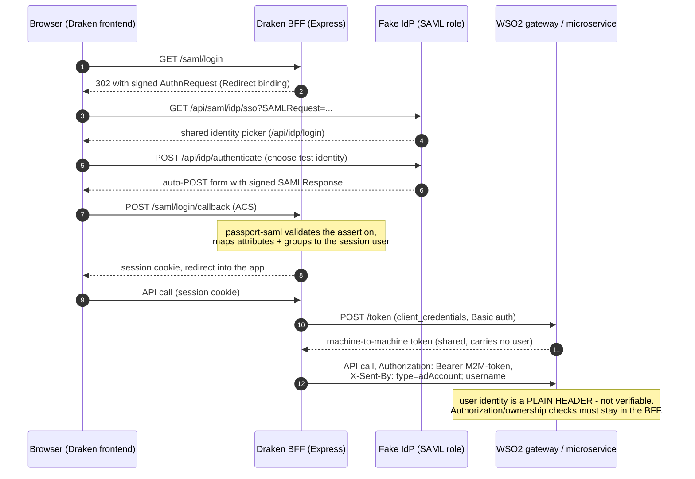
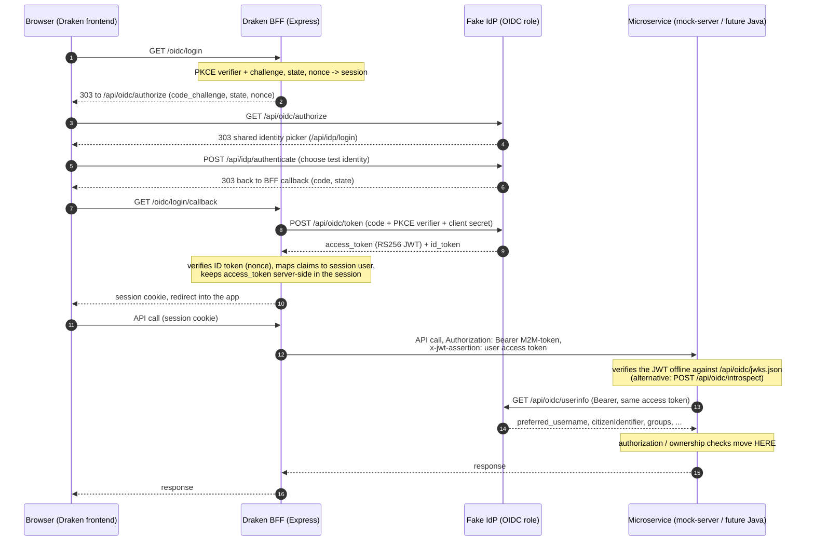

# POC: Additive OIDC login flow in Draken (against fake-idp PR #19)

## Context

The fake-idp (web-app-fake-idp-admin, draft PR #19, branch `feature/oidc`) now implements a standard OIDC
OpenID Provider at `<base>/api/oidc`: discovery, `/authorize`, `/token`, `/userinfo`, `/jwks.json` (RS256),
`/end-session`. Authorization code + PKCE only; clients registered in its admin UI with exact-match redirect
URIs. Claims mirror the SAML assertion: `given_name`, `family_name`, `email`, `preferred_username` (= AD uid),
`groups` as a **JSON array**, custom attributes pass through verbatim — all present in the ID token, so no
`/userinfo` call is needed.

To test it, Draken gets a POC OIDC login flow **alongside** SAML. SAML must keep working unchanged; OIDC is
additive, off by default, controlled by env flags.

Decisions:

- **POC tenant: MEX** (`BASE_URL_PREFIX=/mex`)
- **IdP: fake-idp `feature/oidc` branch via docker compose** — already up, discovery at
  `http://idp.test:7100/idp2/api/oidc/.well-known/openid-configuration` ⇒
  `OIDC_ISSUER_URL=http://idp.test:7100/idp2/api/oidc`
- **Login UX: the flag switches the existing login button** from `/saml/login` to `/oidc/login` (and logout
  likewise)
- **Client type: confidential (client_secret) + PKCE** (fake-idp supports `client_secret_post`)
- **Library: `openid-client` v6** (panva). Plain express handlers, NOT `openid-client/passport`: the v6
  passport Strategy needs a resolved (async-discovered) Configuration at construction, while app.ts wires auth
  synchronously at import — and we need custom successRedirect/failureRedirect/failMessage handling anyway.
  Passport session integration is kept via `req.login(user)` (serialize/deserialize are identity functions,
  `backend/src/app.ts:53-58`).

Baseline: branch `feature/oidc` == `develop` (no OIDC code exists yet).

## Flows: SAML today vs OIDC POC

Rendered version of these diagrams (plus a resource-server endpoint summary):
<https://claude.ai/code/artifact/243346d2-cae7-4098-a025-72dd5abc30ef>
(Claude artifact — private until shared from the page's share menu, so share it before
handing the link to someone else.)

### SAML (current production model)

User identity reaches the microservices only as a plain, unverifiable header — all
authorization/ownership logic must therefore live in the BFF.



### OIDC (this POC — token passes through to the microservice)

The user's access token rides along on every downstream call, so the microservice can
verify the caller itself and take over authorization/ownership checks.



Shared machinery visible in both diagrams: one identity picker (`/api/idp/login`), one test
session, one selected identity — logging out of either protocol ends both.

## Backend changes

### 1. Dependency

`cd backend && yarn add openid-client` (^6.x).

### 2. New module folder `backend/src/oidc/`

**`oidc-client.ts` — lazy memoized discovery** (nothing runs at module load; keeps
`default-auth.runtime.test.ts` green and tolerates the IdP being down at boot):

```ts
let cached: Promise<client.Configuration> | undefined;
export function getOidcConfiguration() {
  if (!cached) {
    const insecure = new URL(OIDC_ISSUER_URL!).protocol === 'http:'; // gate on protocol, not NODE_ENV
    cached = client.discovery(
      new URL(OIDC_ISSUER_URL!), OIDC_CLIENT_ID!, undefined,
      OIDC_CLIENT_SECRET ? client.ClientSecretPost(OIDC_CLIENT_SECRET) : client.None(),
      insecure ? { execute: [client.allowInsecureRequests] } : undefined,
    );
    cached.catch(() => { cached = undefined; }); // IdP down at first login must self-heal
  }
  return cached;
}
```

**`claims-mapping.ts` — pure, unit-testable mapper** mirroring the SAML verify callback
(`backend/src/app.ts:94-142`) minus SAML-only fields. Reuse `authorizeGroups`, `getRole`,
`getLoginPermissions` from `backend/src/services/authorization.service.ts` verbatim:

- Required claims: `given_name`, `family_name`, `email`, `preferred_username`, `groups` (array) — any missing
  → throw error with `name: 'OIDC_MISSING_ATTRIBUTES'`.
- `groups` array → join to CSV → `authorizeGroups(csv)`; fail → `OIDC_MISSING_GROUP`.
- Returns `{ name: `${given_name} ${family_name}`, firstName, lastName, username: preferred_username, email,
  groups: lowercased array, role: getRole(...), permissions: getLoginPermissions(...), authMethod: 'oidc' }`.
  **No** `nameID`/`nameIDFormat`/`sessionIndex` (SAML-only, used by SLO). `authMethod` is a new optional
  discriminator; SAML users simply lack it — SAML code untouched.

**`oidc-router.ts` — `createOidcRouter(): express.Router`** with its own
`rateLimit({ windowMs: 60_000, limit: 100 })` (same as `samlLimiter`, app.ts:213-216):

- `GET /login`: validate `?successRedirect`/`failureRedirect` with `isValidUrl` + `isValidOrigin` (same rules
  as the SAML callback, app.ts:339-348). Await discovery — on failure redirect to failureRedirect (fallback
  `SAML_FAILURE_REDIRECT_MESSAGE`) with `?failMessage=OIDC_DISCOVERY_FAILED`. Generate
  `randomPKCECodeVerifier` → `calculatePKCECodeChallenge` (S256), `randomState`, `randomNonce` (PKCE always
  on, even with a secret). Store all + redirects in `req.session.oidc`, then **`req.session.save()` before
  `res.redirect(buildAuthorizationUrl(...).href)`** — the session must be persisted (Redis/file store) before
  the browser leaves for the IdP.
- `GET /login/callback`: pop `req.session.oidc` (missing → `OIDC_UNKNOWN_ERROR`). Build `currentUrl` from the
  **configured** `OIDC_CALLBACK_URL` + the incoming query string (never from `req.protocol/host` — exact-match
  redirect_uri + proxy host reconstruction is the classic failure).
  `authorizationCodeGrant(config, currentUrl, { pkceCodeVerifier, expectedState, expectedNonce })`, then
  `mapOidcClaimsToSessionUser(tokens.claims())`. Mapper errors → redirect
  `failureRedirect?failMessage=<err.name>`; other errors → `OIDC_UNKNOWN_ERROR`. On success:
  `req.login(user, ...)`, store `req.session.idToken = tokens.id_token`, log
  `Authenticated user ${username} (role: ${role})` like SAML (app.ts:144), `session.save` → redirect to
  successRedirect (fallback `SAML_SUCCESS_REDIRECT`).
- `GET /logout` (degradable RP-initiated logout, mirrors SAML's optional-SLO contract at app.ts:283-285):
  resolve validated successRedirect, grab `req.session.idToken`, `req.logout()`; if idToken + discovery
  succeeds + `end_session_endpoint` exists → redirect to
  `buildEndSessionUrl(config, { id_token_hint, post_logout_redirect_uri: successRedirect })`; any failure →
  plain `res.redirect(successRedirect)` (local-only logout). No logout callback route needed —
  `post_logout_redirect_uri` returns straight to the frontend.

### 3. `backend/src/app.ts` — the only SAML-adjacent edit

In `initializeMiddlewares()`, after the SAML routes (after ~L378) and **before** the default-deny guard at
~L383 (`this.app.use(BASE_URL_PREFIX!, defaultAuthGuard)`):

```ts
if (OIDC_ENABLED) {
  this.app.use(`${BASE_URL_PREFIX}/oidc`, createOidcRouter());
}
```

Do NOT touch `PUBLIC_PATHS` — like SAML, these routes bypass the guard by mount order.

### 4. Config & validation

- `backend/src/config/index.ts`: `export const OIDC_ENABLED = process.env.OIDC_ENABLED === 'true';` (boolean
  idiom, L9-11) + add `OIDC_ISSUER_URL`, `OIDC_CLIENT_ID`, `OIDC_CLIENT_SECRET`, `OIDC_CALLBACK_URL`,
  `OIDC_SCOPES` to the destructure.
- `backend/src/utils/validateEnv.ts` (hand-rolled `warnMissingEnv`, not envalid): after the existing
  conditional branches (~L113), require `OIDC_ISSUER_URL` (url), `OIDC_CLIENT_ID`, `OIDC_CALLBACK_URL` (url)
  **only when `process.env.OIDC_ENABLED === 'true'`**. Flag off ⇒ zero new requirements.
- `backend/src/types/express-session.d.ts`: add to `Session`:
  `oidc?: { codeVerifier: string; state: string; nonce: string; successRedirect?: string; failureRedirect?: string }`
  and `idToken?: string`.
- `OIDC_SCOPES` defaults to `'openid profile email'` in the router (fake-idp always emits groups + custom
  claims regardless of scope). Reuse `SAML_SUCCESS_REDIRECT`/`SAML_FAILURE_REDIRECT_MESSAGE` as redirect
  fallbacks — protocol-agnostic frontend URLs, already required; no new redirect vars.

### 5. Env examples + docker-compose

- Append a commented OIDC block to `backend/.env.example.local` and every
  `backend/.env.{kc,mex,lop,pt,lok,rob,msva,bou,se}.example.local` (tenant-parameterized), e.g. for MEX:

  ```
  # OIDC (POC, additive — leave OIDC_ENABLED unset/false for SAML-only)
  OIDC_ENABLED=false
  OIDC_ISSUER_URL=http://idp.test:7100/idp2/api/oidc
  OIDC_CLIENT_ID={{INSERT CLIENT ID}}
  OIDC_CLIENT_SECRET={{INSERT CLIENT SECRET}}   # omit for a public (PKCE-only) client
  OIDC_CALLBACK_URL=http://localhost:3001/mex/oidc/login/callback
  OIDC_SCOPES=openid profile email
  ```

  (`OIDC_CALLBACK_URL` must live under `BASE_URL_PREFIX` — the session cookie path is scoped to it,
  app.ts:226, or the callback arrives cookieless.)
- `docker-compose.override.yml`: add the OIDC vars with **optional `-` defaults**
  (`OIDC_ENABLED: ${OIDC_ENABLED-false}` etc.) — never `:?err` like the SAML vars, or every existing
  deployment breaks.

## Frontend changes

- `frontend/src/config/appconfig.tsx`: add top-level `isOidcEnabled: envBool(process.env.NEXT_PUBLIC_OIDC_ENABLED)`
  (top-level like `isCaseData`, NOT under `features`, so `resetAllFlagsToFalse`/`applyRuntimeFeatureFlags`
  never touch it; `envBool` keeps entrypoint.sh runtime substitution working).
- `frontend/src/app/[locale]/login/page.tsx:45`: `apiURL(appConfig.isOidcEnabled ? '/oidc/login' : '/saml/login')`
  — keep `window.location.assign` and the identical `successRedirect`/`failureRedirect` queries.
- `frontend/src/app/[locale]/logout/page.tsx`: same flag switch `/saml/logout` ↔ `/oidc/logout`.
- `frontend/public/locales/sv/login.json`: add `OIDC_MISSING_GROUP`, `OIDC_MISSING_ATTRIBUTES`,
  `OIDC_DISCOVERY_FAILED`, `OIDC_UNKNOWN_ERROR` (only `sv` locale exists).
- Frontend env examples: add `NEXT_PUBLIC_OIDC_ENABLED=false`.

Nothing else — the frontend is auth-protocol-agnostic (cookie presence in `proxy.ts` + `GET /me`).

## Tests

- **Keep green**: `backend/src/tests/default-auth.runtime.test.ts` boots the real App; `tests/setup.ts` never
  sets `OIDC_ENABLED` ⇒ flag off, router unmounted, and `oidc-client.ts` does no module-level construction ⇒
  no change needed. Run `yarn test` in backend/.
- **New**: `backend/src/tests/oidc-claims-mapping.test.ts` for the pure mapper, using
  `src/tests/helpers/mock-data.ts` constants only (`mockFirstName`, `mockLastName`, `mockEmail`,
  `mockAdUsername`, `MOCK_DEVELOPER_GROUP`, ... — never hardcoded identifiers): happy path (shape matches
  SAML's user incl. role/permissions; no nameID/sessionIndex), each missing required claim →
  `OIDC_MISSING_ATTRIBUTES`, unauthorized groups → `OIDC_MISSING_GROUP`, groups array→CSV→lowercase behavior.

## Verification (manual E2E, MEX)

1. Fake-idp `feature/oidc` is already running: discovery at
   `http://idp.test:7100/idp2/api/oidc/.well-known/openid-configuration`. Sanity-check the OP itself first via
   its built-in test RP at `http://idp.test:7100/idp2/api/oidc/test`. (The Draken backend runs on the Windows
   host, so `idp.test:7100` must resolve/route from there for the back-channel `/token` call — same host that
   already reaches the idp2 SAML endpoints.)
2. In the fake-idp admin UI, register client `draken-mex` with **exact** redirect URI
   `http://localhost:3001/mex/oidc/login/callback`, post-logout redirect URI = the frontend login URL used in
   logout, and a client secret. Ensure a test user has a `groups` attribute intersecting MEX's
   `AUTHORIZED_GROUPS` (and an admin/developer group so `getRole` resolves).
3. Backend: set the OIDC block in `.env.mex.development.local` with `OIDC_ENABLED=true`; `yarn dev:mex`.
   Confirm boot succeeds **with the IdP stopped** too (lazy discovery — first login then fails with
   `OIDC_DISCOVERY_FAILED`, not a crash).
4. Frontend: `NEXT_PUBLIC_OIDC_ENABLED=true`; log in via the login button → IdP `/authorize` → identity picker
   → back on successRedirect with session cookie (path `/mex`; callback is a top-level GET so SameSite=Lax is
   fine). Verify `GET /mex/me` returns the mapped user, spot-check role/permissions, open a protected page.
   Backend log should show `Authenticated user <uid> (role: ...)`.
5. Negative paths: user without authorized groups → `/login?failMessage=OIDC_MISSING_GROUP` (Swedish message
   renders); user missing an attribute → `OIDC_MISSING_ATTRIBUTES`; tampered `state` on the callback →
   `OIDC_UNKNOWN_ERROR`.
6. Logout → IdP `/end-session` with `id_token_hint` → back at `/login?loggedout`; `/me` now 401. Stop the IdP
   and verify logout degrades to local-only redirect.
7. Regression: flags off, restart, full SAML login/logout against the usual fake IdP works unchanged; backend
   `yarn test` green; frontend `yarn lint:strict`.

## Risks / gotchas

- Session save race: explicit `req.session.save()` before both outbound redirects (SAML never needed this —
  RelayState — OIDC does).
- Exact redirect_uri matching: derive callback `currentUrl` from config, not from the request.
- Cookie path = `BASE_URL_PREFIX`: callback URL must be under it.
- `allowInsecureRequests` gated on `http:` issuer protocol, never NODE_ENV.
- Discovery promise cache cleared on rejection (IdP outage self-heals).
- Every emitted `failMessage` code must exist in `sv/login.json` or the raw i18n key renders.
- `id_token` in session adds ~1–2 KB per session record — fine for POC, note for productization.
- Known pre-existing quirk, deliberately NOT touched: `User.personId` is never set by SAML either (avatar
  endpoint 400s today) — do not replicate or fix in this POC.

## Resource server / token pass-through (POC extension)

Target architecture: authorization/ownership moves from this BFF into the Java microservice layer.
The frontend logs in at the OIDC IdP, the BFF holds the token, and downstream services verify the
token themselves against the IdP. This POC demonstrates the whole chain.

### What the BFF does now

- The callback stores `tokens.access_token` (+ derived `accessTokenExpiresAt`, epoch seconds) on the
  session user (`oidc-router.ts`; fields declared in `users.interface.ts`). Server-side session store
  only — the token never reaches the browser.
- `ApiService.request()` forwards it on every downstream call as **`x-jwt-assertion`** — the header
  WSO2 already uses to hand services the end-user JWT — while the machine-to-machine
  `client_credentials` token stays in `Authorization`. SAML logins have no token, so the header is
  simply absent (nothing downstream may *require* it until SAML is retired).
- Known edge: the response interceptor's location-header follow-up request uses bare default headers
  and does not carry `x-jwt-assertion`.

### How a Java microservice verifies the token

The IdP's access tokens are self-contained RS256 JWTs (`typ: at+jwt`; `iss`, `sub`, `aud`, `scope`,
`client_id`, `exp`, `iat`). Two standard options:

**Offline (recommended): JWT validation against the JWKS** — no per-request IdP call, keys cached.

```yaml
spring:
  security:
    oauth2:
      resourceserver:
        jwt:
          # Autodiscovery: fetches <issuer>/.well-known/openid-configuration, then jwks_uri.
          issuer-uri: http://localhost:7101/api/oidc
          # ...or skip discovery and pin the keys directly:
          # jwk-set-uri: http://localhost:7100/api/oidc/jwks.json
```

Caveat: the IdP serves discovery **only on the issuer's own host** (a conformant RP would otherwise
hard-fail on issuer mismatch), so `issuer-uri` autodiscovery must reach exactly that origin. `jwk-set-uri`
avoids this — the JWKS endpoint is deliberately origin-agnostic and answers on the backend's direct
port too.

**Online: RFC 7662 introspection** — `POST /api/oidc/introspect`, client-authenticated
(`client_secret_basic`/`client_secret_post`), returns `{"active": true, "sub": ..., "scope": ...}` or
`{"active": false}`. Register the resource server as its own confidential client in the IdP admin UI.

```yaml
spring:
  security:
    oauth2:
      resourceserver:
        opaquetoken:
          introspection-uri: http://localhost:7101/api/oidc/introspect
          client-id: <resource-server-client>
          client-secret: <secret>
```

Note: the IdP's tokens are storeless, so introspection is signature + issuer + expiry — nothing can be
revoked before `exp`. Spring reads the token from `Authorization: Bearer`; a service consuming
`x-jwt-assertion` instead verifies the JWT explicitly (nimbus-jose-jwt against the JWKS URL) or maps
the header before the filter chain.

### Resolving the user for authorization (decided: `/userinfo`)

A verified access token identifies the user only as `sub` — the IdP's internal user id. Ownership
and role checks need the identity claims (`preferred_username`, `citizenIdentifier`, `groups`, …),
which live in the ID token and stay in the BFF. **Chosen approach for the POC:** the resource server
presents the SAME access token it received back to the IdP's `/userinfo`:

```bash
curl -H "Authorization: Bearer <access token from x-jwt-assertion>" \
     http://idp.test:7101/idp2/api/oidc/userinfo
# → { "sub": ..., "name": ..., "preferred_username": ..., "citizenIdentifier": ...,
#     "groups": [...], "email": ..., ... }
```

- Standard OIDC, zero IdP changes. An invalid/expired token gets 401 (`WWW-Authenticate: Bearer`),
  so the call doubles as online verification.
- `/userinfo` is origin-agnostic (unlike discovery), so a service can call the IdP backend's direct
  port: `http://idp.test:7100/api/oidc/userinfo`. `POST` with form field `access_token` also works.
- Only access tokens are accepted — an ID token is rejected with 401.
- Cost is one IdP call per request; cache the response keyed on the token (claims cannot change
  faster than a re-login anyway, so caching until `exp` is safe here).
- Deliberately NOT done (for now): enriching the access token itself with identity claims (the
  `x-jwt-assertion` model WSO2 uses) or extending the introspection response with `username`/
  `groups` — both are IdP changes to revisit when the Java side's preference is known.

### Local stand-in: mock-server

No Java service runs locally, so `/home/dev/Web/mock-server` plays the resource server: started with
`JWT_VERIFY=true`, it verifies `x-jwt-assertion` (fallback `Authorization: Bearer`) against the IdP's
JWKS (`OIDC_JWKS_URL`, default `http://localhost:7100/api/oidc/jwks.json`) and expected issuer
(`OIDC_ISSUER`, default `http://localhost:7101/api/oidc`), answering 401 on missing/invalid tokens.
Point `API_BASE_URL=http://localhost:8080` at it to run Draken's calls through the verification.

### Token lifetime

The fake IdP issues **no refresh tokens**. Draken's session lives 12 h; the access token defaults to
1 h, after which downstream calls 401 until re-login. For demos, stretch it on the IdP stack:
`OIDC_ACCESS_TOKEN_TTL=43200` in the fake-idp `.env` (passed through its docker-compose). Real
productization needs the refresh-token grant on the IdP + refresh logic here.
