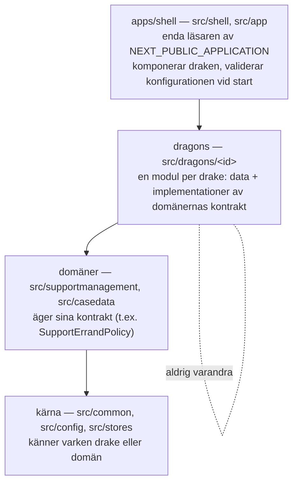

# Beslut: en modul per drake bakom en CI-hållen gräns

|          |                                                                                                                      |
| -------- | -------------------------------------------------------------------------------------------------------------------- |
| Status   | Beslutat 2026-09-04, steg 1–3 införda i samma PR som detta dokument                                                  |
| Gäller   | `frontend/` (backend följer samma mönster i mindre skala, se sist)                                                   |
| Reglerna | [`boundaries.md`](boundaries.md) är den maskinläsbara referensen; det här dokumentet är _varför_                     |
| Siffror  | Räknade på commit `a9847cd4` (`feature/utvecklingssprint-start`) med grep över `frontend/src`, testfiler exkluderade |

Draken är en Next.js-app som körs som fjorton drakar (kc, ka, mex, pt, rob, lop, ik, msva, se,
bou, lok, iaf, vof, aot). Frågan som väcktes var om apparna borde brytas ut i egna repon för att
slippa krockar. Svaret blev nej: krockarna beror inte på repo-layouten utan på _hur variationen
uttrycks_, och det löses med tydliga lager och en gräns som CI håller, inte med fler repon.

## Nuläget som beslutet utgick från

Repot är två fristående paket i samma mapp (rotens `package.json` kedjar `yarn --cwd frontend`
och `yarn --cwd backend`; inga workspaces, två lockfiles). Frontend delar routes, komponenter och
services mellan alla drakar. Vilken drake som kör avgörs av `NEXT_PUBLIC_APPLICATION`, som
`entrypoint.sh` sed-ersätter i den färdigbyggda bundeln vid containerstart: **en image, fjorton
deployments**.

| Mätpunkt                                          | Värde                                                              |
| ------------------------------------------------- | ------------------------------------------------------------------ |
| Drake-predikat (`isKC()`, `isROB()` …) i frontend | 103 anrop i 32 filer, varav 66 i casedata                          |
| …i supportmanagement                              | 30                                                                 |
| Direkta läsningar av `NEXT_PUBLIC_APPLICATION`    | 21                                                                 |
| Capability-flaggor i `appconfig`                  | 33 booleska, 102 läsningar                                         |
| `common`-filer som importerar en domän            | 21 unika (17 casedata, 15 supportmanagement)                       |
| SM-drakar med e2e i CI                            | 5 av 12 (kc, lop, iaf, vof, aot); mex och pt täcks av casedata-e2e |

Kodbasen var alltså redan mest flaggstyrd; drake-namnsbranching var en rest på ett trettiotal
ställen i supportmanagement plus miljöläsningarna. Men `common` nådde in i båda domänerna, och
inget i bygget, linten eller CI sa ifrån när en ändring för en drake ändrade beteendet för en annan.

## Krocken, konkret

`support-close-errand-button.component.tsx` avgjorde avslutsorsaker med en if-kedja:
`isLOP()`, `isIK() || isSE()`, `isKA()`, `isROB()`, `isBOU()`, `isLOK()`, annars KS. Filen körs
av de tolv supportmanagement-drakarna. En ändring för ROB rörde en fil elva andra drakar kör;
fem av dem har e2e, ROB själv har det inte. Gränsen mellan drakarna fanns bara i huvudet på den
som kodade.

Utredningsseamen för IAF/VOF och AOT var det närmaste en gräns som fanns, och den bevisade
mindre än man kunde tro: kontraktstestet är ett kompileringsskydd för kontraktet (fixturerna
importerar aldrig avvikelse), inte en analys av importgrafen; ingen importregel fanns i ESLint;
AOT:s utredningsflik är en placeholder.

## Beslutet

**Fyra lager, import bara nedåt.**

**Kontrakten ägs av domänerna, inte av ett centralt profilobjekt.** Det första utkastet hade ett
allomfattande `DrakeProfile` i kärnan. Granskningen visade att det bara hade flyttat komplexiteten:
kärnan hade behövt ändras varje gång en drake behövde något nytt, och variationen är av olika
slag (texter och alternativ är konfiguration, utredningsflöden är verksamhetslogik, formulär och
paneler är komponenter, behörighet hör hemma i API:t). Därför äger supportmanagement
`SupportErrandPolicy` (pågående statusar, avslutsorsaker, standardavslut, etikett för löst ärende),
varje drake levererar sina avvikelser i `src/dragons/<id>/`, och skalet slår ihop dem över
domänens standard.

**Identitet, variant och capability är tre olika saker.** Appidentiteten är ett explicit värde som
bara skalet läser. En variant är exakt ett giltigt alternativ av ömsesidigt uteslutande (de två
utredningsimplementationerna); två aktiva är ett konfigurationsfel som stoppar uppstarten, på
samma sätt som backendens `validateEnv.ts` stoppar fel namespace. Registrets first-wins finns kvar
som skyddsnät bakom valideringen, inte som princip. Capabilities är oberoende flaggor som får
kombineras. Behörighet är en fjärde sak och härleds aldrig ur en profil: API:t nekar, BFF:en
vidarebefordrar.

**Gränsen hålls av CI, med en baseline som bara får krympa.** dependency-cruiser äger
importreglerna, ESLint äger regeln mot miljöläsningar. Befintliga överträdelser är inspelade i
två baseline-filer; nya faller, och `scripts/boundaries-baseline-guard.mjs` fäller varje PR där en
baseline växer. Så kan reglerna slås på dag ett utan att flytta hela kodbasen.

**Casedata får begränsad nyutveckling men är inte isolerad.** Den påverkas av kärna, auth,
api-klient och beroenden, så mex/pt-e2e stannar i matrisen. CODEOWNERS är en granskningsprocess,
inte en teknisk gräns, och kan inte avgöra om en ändring är buggfix eller ny funktion.

**Workspaces kommer sist, inte först.** Att flytta filer innan seamen finns hade gett ett `core`
fullt av samma if-satser plus fjorton tunna appar. När gränserna håller är flytten mekanisk.

## Alternativ som valdes bort

| Alternativ                                                  | Varför inte                                                                                                                                                                                                                  |
| ----------------------------------------------------------- | ---------------------------------------------------------------------------------------------------------------------------------------------------------------------------------------------------------------------------- |
| Ett repo per drake med versionssatta paket                  | Ger verklig självständighet bara om man är beredd att köra och supporta olika versioner av `common` i drift samtidigt. Med ett team och en releasetakt är det overhead utan nytta. Frågan hålls öppen tills gränserna finns. |
| Centralt `DrakeProfile` i kärnan                            | Flyttar komplexiteten utan att minska den; kärnan blir en ny version av dagens för generella `common`.                                                                                                                       |
| Generalisera registrets first-wins till all drakkomposition | Deterministiskt men inte nödvändigtvis rätt; en felkonfiguration ger fel verksamhetsflöde utan att stoppas.                                                                                                                  |
| Förbjuda `common → domän` fullt ut dag ett                  | Flera filer under `common` var appkomposition (layout, sidomeny) som ska _upp_ till skalet, inte ned i kärnan. Därav baseline plus förbud mot nya.                                                                           |

## Tre sätt att deploya

Samma kod fungerar med alla tre. Fan-out sker vid deploy i A, vid build i B och C. En pipeline
med matris räcker i alla tre; vad som måste byggas om avgörs av beroendegraf och releasepolicy,
inte av antalet images.

|                           | A · en image (dagens) | B · image per produktfamilj      | C · image per drake                          |
| ------------------------- | --------------------- | -------------------------------- | -------------------------------------------- |
| Builds per release        | 1                     | 3 (support, avvikelse, casedata) | 14                                           |
| Vad som skiljer drakarna  | miljö vid start       | bundle per familj, miljö inom    | bundeln                                      |
| Isolering                 | gränsregel + e2e      | fysisk mellan familjer           | fysisk, _bara_ med egen entrypoint per drake |
| Störning för dagens drift | ingen                 | två nya byggmål                  | ny release-rutin                             |
| Rekommendation            | börja här             | när avvikelse divergerar         | när gränsen bevisligen hålls                 |

Utan egna entrypoints följer alla implementationer med även i C, via registret. Bilden gäller
frontend; backend har egen Dockerfile.

## Planen och var vi står

| Steg | Innehåll                                                                       | Klart när                        | Status                                                             |
| ---- | ------------------------------------------------------------------------------ | -------------------------------- | ------------------------------------------------------------------ |
| 1    | Baseline + förbud mot nya överträdelser                                        | CI stoppar nya                   | **Införd**                                                         |
| 2    | Pilot: ROB:s ärendepolicy som SM-ägt kontrakt, med tester                      | Ändringen rör bara `dragons/rob` | **Införd**                                                         |
| 3    | Flytta ansvar: layout upp till skalet, undantag bort                           | Baseline krymper per sprint      | **Påbörjad** (93 → 79 importöverträdelser, 16 → 15 miljöläsningar) |
| 4    | Yarn workspaces (`packages/*`, `dragons/*`, `apps/shell`), en lockfile i roten | En lockfile, regler per paket    | Ej påbörjad                                                        |
| 5    | Deploybeslut A, B eller C efter releasepolicy                                  | Pipeline matchar                 | Ej påbörjad                                                        |

Steg 2 är mätpunkten: om nästa ändring för ROB bara rör ROB:s modul finns konkret stöd för att
fortsätta. Om den ändå kräver ändringar i delad kod är hypotesen fel och planen ska justeras innan
mer flyttas. Acceptanskriteriet är inte bara "noll `isX()`": ingen kod utanför skalet får läsa
appidentiteten alls, varken via miljövariabeln, `application-service` eller ett profilobjekt.

## Frågor som återstår

- Kan en verklig AOT-funktion byggas utan att röra avvikelse eller utöka ett centralt kontrakt?
- Vilka delar är samma verksamhetsbegrepp mellan drakarna, och vilka råkar bara likna varandra?
- Vem äger de gemensamma kontrakten och beslutar om ändringar i dem?
- Vilket problem ska lösas först: samordningsbehov, regressionsrisk, releasekoppling eller byggkostnad?
- Vilket team ska stå i CODEOWNERS för casedata?

## Backend

Nio filer branchar på `APPLICATION`. Utredningsprofilen och `getSupportInvestigationProfile` är
verksamhetspolicy och stannar i BFF:en; auktorisering stannar i API:t. Ingen av dem ska härledas ur
en frontendprofil. Samma lagerregler kan införas där med samma verktyg när det blir aktuellt.

## Underlag

Beslutet togs efter ett första underlag och en oberoende granskning som rättade fyra
faktapåståenden (antal `common`-filer, antal flaggor, att MEX/PT inte kör supportmanagement-koden,
och att kontraktstestet inte analyserar importgrafen) och fällde det centrala profilobjektet.
Den visuella versionen av underlaget, med diagrammen, finns som delbar sida:
https://claude.ai/code/artifact/40a13956-5e40-4a47-bd9d-6b2233a8b6d6
