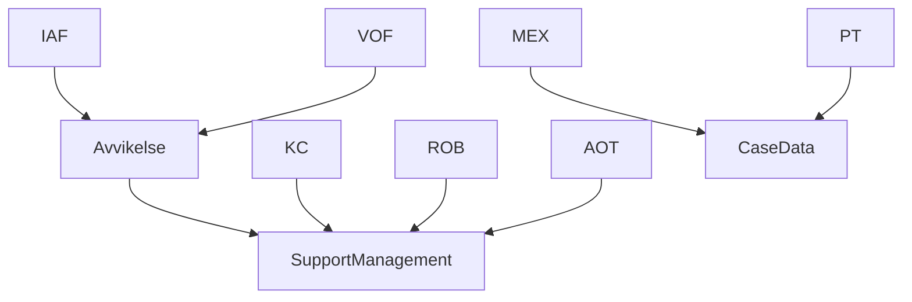

# Utveckla och leverera drakar

Varje drake är en applikation i samma repo och har ett eget bygg- och releasemål.
SupportManagement och CaseData är återanvändbart domänstöd. Avvikelse är en verksamhetsmodul
ovanpå SM som IAF och VOF använder. Det finns ingen separat byggfamilj för Avvikelse.



Övriga SM-drakar följer samma mönster som KC. AOT äger sin egen utredningsimplementation;
den är fortfarande en platshållare. Drakar importerar aldrig varandra.

## Hitta rätt ägare

| Ändring | Kanonisk ägare |
| --- | --- |
| Identiteter, domän och tillåtna utredningsmoduler | Rotens `dragons.json`; används för inventering och validering, importerar ingen applikationskod. |
| En drakes frontend-sammansättning | `frontend/src/dragons/<id>/application.ts`; väljer delade vyer och utredning. `index.ts` och namngivna policyfiler äger drakens överstyrningar. |
| En drakes backend-sammansättning | `backend/src/dragons/<id>/application.ts`; väljer controllers och eventuell utredningsprofil. `server.ts` startar denna applikation. |
| Delade sidvyer och API-uppsättningar | `frontend/src/shell/ui/` och `backend/src/shell/*-controllers.ts`; drakar återanvänder samma implementation. |
| Generellt SM-stöd | `frontend/src/supportmanagement/`, backendens SM-controllers och `support-*`-services/config. |
| Avvikelses användarflöde och scheman | `frontend/src/avvikelse/`. IAF och VOF importerar samma modul. |
| Avvikelses dokument, klassificering och lagrumsregler | `backend/src/avvikelse/`. Draken väljer profilen; SM gissar aldrig regler från namnet IAF/VOF. |
| JSON-transport, schemahantering och samtidiga skrivningar | Backendens `support-json-parameter.service.ts`, `schema-bound-json.service.ts` och befintliga SM-skrivgränser. |
| Presentation och transport utan domänval | `frontend/src/common/`. |

Frontend och backend behåller sina befintliga paket och lockfiler. En drakes två
applikationsmappar är tydliga kompositionspunkter inom dessa paket; de är inte separata
npm-paket. Vi behöver inga kopior av Next-konfiguration, SM eller byggpipeline per drake.

Avvikelse uppfyller befintliga domänkontrakt. Frontend registrerar sin `InvestigationVariantModule`.
Backendens profil får en `SupportInvestigationClassificationPolicy` med regler för tillåtna
parameterändringar och klassificering. Profilens beteende är endast för servern; API-svaret
innehåller uttryckligen valda dokument och tillstånd. Vanliga SM-drakar har ingen Avvikelse-policy.

Dela kod när den representerar samma begrepp och regel. En liknande skärmbild är i sig inget
skäl att slå ihop olika verksamhetsregler. Börja med befintlig ägare och ett verkligt flöde.

## Bygg- och driftkontrakt

`DRAKEN_BUILD_DRAGON=IAF` väljer IAF vid build. Nexts `@dragon` pekar på exakt
`dragons/iaf/application.ts`. Bootstrap laddar dess policy, vyer och variant; det finns ingen
universell produktionsregistrering av alla drakar. Testinventarierna hålls utanför produktionsgrafen.

Backend kompileras från `dragons/iaf/server.ts`. Bara nåbara moduler tas med i `backend/dist-IAF/`.
Den gemensamma CLI:n skapar en tillfällig tsconfig och tar bort den efteråt. Gamla utdata för just
den draken rensas före bygget. KC-bygget innehåller varken CaseData-controllers eller Avvikelses
verksamhetskod; IAF bygger SM och Avvikelse tillsammans.

En IAF-image kan bara startas som IAF, även om VOF delar implementation. Båda tjänsterna
kontrollerar imagen mot dess fasta identitet. Frontend validerar även domän- och utredningsflaggor
vid start och efter att Adminpanel har svarat. Flaggor kan stänga av en vald funktion; de kan
inte välja en annan applikation eller ladda en annan utredning. KC kan exempelvis inte aktivera AOT.

Detta ersätter inte API-behörigheter. Varje deployment behöver egna avsedda credentials,
namespace och gruppkonfiguration. De återanvända controllerlistorna är explicita men innehåller
fortfarande befintliga gemensamma API:er; granska klientens API-prenumerationer när en drake införs.

## Lokal utveckling

```sh
yarn install --frozen-lockfile
yarn --cwd frontend install --frozen-lockfile
yarn --cwd backend install --frozen-lockfile
yarn dragon list
yarn dragon dev IAF frontend
yarn dragon dev IAF backend
yarn dragon build IAF
yarn dragon start IAF
```

Utan sista argumentet kör `dev` och `start` båda tjänsterna, medan `build` bygger dem i ordning.
CLI läser `frontend/.env.<id>` och `backend/.env.<id>.development.local`, samt backendens
production-fil vid `start`. Befintliga miljövariabler vinner över filerna. CLI sätter identitet
och byggmål. Använd olika `PORT` i respektive tjänsts env-fil när båda startas tillsammans.
De äldre `dev:iaf`, `build:kc` osv. är alias; nya drakar behöver inga nya package-scripts.

Om en befintlig Next-utvecklingscache fastnar efter flytten: stoppa drakens dev-server, rensa
endast `frontend/.next-<ID>/dev/` och starta igen. Produktionsutdata och andra drakars byggen
behöver inte rensas.

## Lägg till en drake

1. Lägg till identiteten i `dragons.json` med `domain: "supportmanagement"` eller `"casedata"`
   och `investigation: null` eller en avsedd implementation. Detta är inte en byggfamilj.
2. Skapa `frontend/src/dragons/<id>/index.ts` med `DragonModule`. Lägg bara drakens konkreta
   överstyrningar här. `application.ts` exporterar `dragon`, återanvänd `applicationUi` och
   `configureApplication`, som registrerar valda utredningar eller en tom lista. Använd KC som
   minimalt exempel, IAF för delad Avvikelse och AOT för en egen utredning.
3. Skapa `backend/src/dragons/<id>/application.ts` med `DragonApplication` och en liten
   `server.ts`. Välj befintliga controllers. Lägg till profil och verksamhetspolicy bara när
   draken behöver dem. Kopiera inga services eller controllers.
4. Lägg till draken i de typade **testinventarierna**:
   `frontend/src/shell/dragon-registry.test-fixture.ts` och
   `backend/src/tests/helpers/dragon-applications.ts`. Saknade identiteter blir typfel.
5. Lägg till env-exempel för båda tjänsterna, utan hemligheter. Ange domän, capabilities,
   namespace, adresser och gruppkonfiguration. Backend validerar driftmiljön vid start.
6. Lägg till ett relevant Playwright-projekt och CI-test för drakens flöde. Återanvänd fixtures.
   Den generella byggmatrisen hämtar alla identiteter ur katalogen automatiskt.
7. Kör kontrollerna nedan och verifiera att oönskade routes och implementationer inte ingår.

En ny Avvikelse-konsument behöver också ett uttryckligt verksamhetsbeslut: dagens fasta
klassificeringsregler är avsedda för IAF/VOF. Att sätta en flagga ger inte automatiskt rätt policy.
En ny sorts utredning uppfyller SM:s kontrakt och väljs i den berörda drakens sammansättning.

## Nästa del av Avvikelse

Basen innehåller förarbete, inte ett färdigt Avvikelse-system. Börja med ett konkret dokument
eller användarflöde: aktör, tillåten övergång och beteende vid nekad åtkomst, saknad profil,
ogiltigt schema eller versionskonflikt. Implementera verksamhetsregeln i Avvikelse och återanvänd
SM:s dokument-, schema- och skrivstöd. Gemensamma SM-vyer ska inte behöva `isIAF()` för flödet.

Bevisa tillåtna och nekade skrivningar genom HTTP-tester och hela flödet i webbläsaren.
Kör AOT och KC som regression för delat SM-stöd. IAF och VOF delar verksamhetsmodul men kan ha
olika miljökonfiguration; båda finns i CI:s webbläsarmatris.

## Validering

```sh
yarn type-check
yarn test
yarn lint
node scripts/boundaries-baseline-guard.mjs HEAD
yarn dragon build IAF backend
node scripts/check-backend-artifact.mjs IAF
yarn dragon build IAF frontend
# Starta motsvarande frontend innan Playwright:
yarn --cwd frontend test:e2e:iaf
```

CI bygger alla katalogens drakar i både frontend och backend. Backendartefakten kontrolleras för
fel drake, fel domän, oönskad Avvikelse-kod och testfiler. API-testerna går igenom samtliga
applikationers registrerade routes, inklusive autentiserade anrop över fel domängräns.
Containerpaketeringen provas för KC, IAF och MEX. Playwright täcker MEX, PT, KC, LOP, IAF, VOF,
AOT och schema-labben (som endast är en utvecklingsroute).

Importbaselinen har gått från 79 till 38 överträdelser. Inga direkta importer mellan SM och
CaseData kvarstår; äldre identitetsläsningar och `common → domän` finns kvar. Därför kan vissa
äldre delade frontendkomponenter/stores fortfarande dra in delar av annan domän. Påstå inte att
alla frontendbytes redan är isolerade. Baselinen får bara krympa. Knip har äldre fynd som
behöver hanteras hos rätt ägare, inte döljas med nya undantag.

## Leverera och återställ

Dockerbyggkontexten är **reporoten**:

```sh
docker build -f frontend/Dockerfile --build-arg DRAKEN_BUILD_DRAGON=IAF -t draken-frontend:iaf .
docker build -f backend/Dockerfile --build-arg DRAKEN_BUILD_DRAGON=IAF -t draken-backend:iaf .
```

Välj samma drake i frontend och backend, tagga med commit och leverera till drakens miljö.
Compose kräver också `DRAKEN_BUILD_DRAGON`. Runtime-identiteten måste matcha imagen.
Env-placeholders finns kvar för miljöberoende värden, och deras värden loggas inte vid ersättning.

Externa Tekton-/driftpipelines behöver byta byggkontext till reporoten och ange drake före
leverans. Backendens namngivna datavolym monteras på `/app/backend/data`; behåll dess innehåll.
Detta arbete ändrar inga lagrade ärenden eller dokument. Återställ genom att leverera tidigare
frontend- och backendimages tillsammans med deras tidigare konfiguration. Senare ändringar av
lagrade dokument behöver en egen plan för schemaversioner och återställning.
