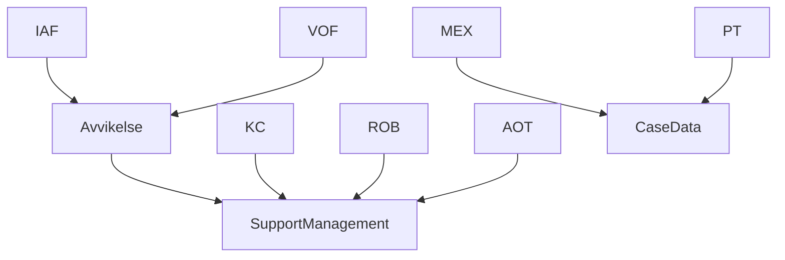

# Utveckla och leverera drakar

Varje drake är en applikation i samma repo och har ett eget bygg- och releasemål.
SupportManagement och CaseData är återanvändbart domänstöd. Avvikelse är en verksamhetsmodul
ovanpå SM som IAF och VOF använder. Det finns ingen separat byggfamilj för Avvikelse.



Övriga SM-drakar följer samma mönster som KC. AOT äger sin egen utredningsimplementation;
den är fortfarande en platshållare. Drakar importerar aldrig varandra.

## Hitta rätt ägare

| Ändring | Kanonisk ägare |
| --- | --- |
| Identiteter och domän | Rotens `dragons.json`; används för inventering och validering, importerar ingen applikationskod. |
| En drakes frontend-sammansättning | `frontend/src/dragons/<id>/application.ts`; väljer delade vyer och utredning. `index.ts` och namngivna policyfiler äger drakens överstyrningar. |
| En drakes backend-sammansättning | `backend/src/dragons/<id>/application.ts`; väljer controllers och eventuell SM-applikationsprofil. `server.ts` startar denna applikation. |
| Delade sidvyer och API-uppsättningar | `frontend/src/shell/ui/` och `backend/src/shell/*-controllers.ts`; drakar återanvänder samma implementation. |
| Generellt SM-stöd | `frontend/src/supportmanagement/`, backendens SM-controllers och `support-*`-services/config. |
| Avvikelses användarflöde och scheman | `frontend/src/avvikelse/`. IAF och VOF importerar samma modul. |
| Avvikelses dokument, klassificering och lagrumsregler | `backend/src/avvikelse/`. Draken väljer profilen; SM gissar aldrig regler från namnet IAF/VOF. |
| JSON-transport, schemahantering och samtidiga skrivningar | Backendens `support-json-parameter.service.ts`, `schema-bound-json.service.ts` och befintliga SM-skrivgränser. |
| Presentation och transport utan domänval | `frontend/src/common/`. |

Frontend och backend behåller sina befintliga paket och lockfiler. En drakes två
applikationsmappar är tydliga kompositionspunkter inom dessa paket; de är inte separata
npm-paket. Vi behöver inga kopior av Next-konfiguration, SM eller byggpipeline per drake.

Avvikelse uppfyller befintliga domänkontrakt. Frontend registrerar sin `InvestigationModule`.
Backendens profil får en `SupportInvestigationClassificationPolicy` med regler för tillåtna
parameterändringar och klassificering. Profilens beteende är endast för servern; API-svaret
innehåller uttryckligen valda dokument och tillstånd. Vanliga SM-drakar har ingen Avvikelse-policy.

Dela kod när den representerar samma begrepp och regel. En liknande skärmbild är i sig inget
skäl att slå ihop olika verksamhetsregler. Börja med befintlig ägare och ett verkligt flöde.

## Bygg- och driftkontrakt

`DRAKEN_BUILD_DRAGON=IAF` väljer IAF vid build. Nexts `@dragon` pekar på exakt
`dragons/iaf/application.ts`. Bootstrap laddar dess policy, vyer och utredningsimplementation; det finns ingen
universell produktionsregistrering av alla drakar. Testinventarierna hålls utanför produktionsgrafen.

Backend kompileras från `dragons/iaf/server.ts`. Bara nåbara moduler tas med i `backend/dist-IAF/`.
Den gemensamma CLI:n skapar en tillfällig tsconfig och tar bort den efteråt. Gamla utdata för just
den draken rensas före bygget. KC-bygget innehåller varken CaseData-controllers eller Avvikelses
verksamhetskod; IAF bygger SM och Avvikelse tillsammans.

En IAF-image kan bara startas som IAF, även om VOF delar implementation. Båda tjänsterna
kontrollerar imagen mot dess fasta identitet, commit och ett gemensamt release-manifest.
Domänen härleds från bygget; gamla domänflaggor i Adminpanel ignoreras.
Frontend validerar utredningsflaggor vid start och efter att Adminpanel har svarat. Flaggor kan stänga av en vald funktion; de kan
inte välja en annan applikation eller ladda en annan utredning. KC kan exempelvis inte aktivera AOT.

Detta ersätter inte API-behörigheter. Varje deployment behöver egna avsedda credentials,
namespace och gruppkonfiguration. De återanvända controllerlistorna är explicita men innehåller
fortfarande befintliga gemensamma API:er; granska klientens API-prenumerationer när en drake införs.

## Lokal utveckling

```sh
yarn install --frozen-lockfile
yarn --cwd frontend install --frozen-lockfile
yarn --cwd backend install --frozen-lockfile
yarn dragon list
yarn dragon dev IAF frontend
yarn dragon dev IAF backend
yarn dragon build IAF
# Starta en enskild produktionsbackend för felsökning (port 3000 måste vara ledig):
DRAKEN_DEPLOYMENT_FILE=/secure/iaf-test.json DRAKEN_SECRET_DIRECTORY=/secure/draken-secrets yarn dragon start IAF backend
```

Utan sista argumentet kör `dev` båda tjänsterna, medan `build` bygger dem i ordning.
`start` kräver vald tjänst; produktionspar startas med genererad Compose.
Vid utveckling läser CLI `frontend/.env.<id>` och `backend/.env.<id>.development.local`.
Befintliga miljövariabler vinner över utvecklingsfilerna. Backendens produktionsstart kräver
release-manifestet och läser aldrig utvecklingsfiler. Frontend kan också startas separat med
sin env-fil för lokala, mockade Playwright-prov; Dockerstart kräver alltid manifestet.
CLI sätter identitet och byggmål. Använd olika `PORT` i respektive tjänsts env-fil vid utveckling.
Kör produktionsparet med Compose enligt [leveranskontraktet](../../deployments/README.md),
så får tjänsterna separata containrar och manifestets hostportar.
De äldre `dev:iaf`, `build:kc` osv. är alias; nya drakar behöver inga nya package-scripts.

Om en befintlig Next-utvecklingscache fastnar efter flytten: stoppa drakens dev-server, rensa
endast `frontend/.next-<ID>/dev/` och starta igen. Produktionsutdata och andra drakars byggen
behöver inte rensas.

## Lägg till en drake

1. Lägg till identiteten i `dragons.json` med enbart `domain: "supportmanagement"` eller `"casedata"`.
   Utredningens implementation väljs i applikationskoden.
2. Skapa `frontend/src/dragons/<id>/index.ts` med `DragonModule`. Lägg bara drakens konkreta
   överstyrningar här. `application.ts` exporterar `dragon`, återanvänd `applicationUi` och
   `configureApplication`, som anropar `configureInvestigation(implementation)` eller `configureInvestigation(null)`. Använd KC som
   minimalt exempel, IAF för delad Avvikelse och AOT för en egen utredning.
3. Skapa `backend/src/dragons/<id>/application.ts` med `DragonApplication` och en liten
   `server.ts`. Välj befintliga controllers. Lägg till profil och verksamhetspolicy bara när
   draken behöver dem. Kopiera inga services eller controllers.
4. Lägg till draken i de typade **testinventarierna**:
   `frontend/src/shell/dragon-registry.test-fixture.ts` och
   `backend/src/tests/helpers/dragon-applications.ts`. Saknade identiteter blir typfel.
5. Lägg till env-exempel för båda tjänsterna, utan hemligheter. Ange capabilities,
   namespace, adresser och gruppkonfiguration. Backend validerar driftmiljön vid start.
6. Lägg till draken i `frontend/e2e/dragon-coverage.json` och ett relevant Playwright-flöde.
   SM-drakar kan återanvända `dragon-smoke/` med den egna byggda applikationen.
   Katalog- och onboardingtester kräver env-exempel, entrypoints och testtäckning.
   Den generella byggmatrisen hämtar alla identiteter ur katalogen automatiskt.
7. Kör kontrollerna nedan och verifiera att oönskade routes och implementationer inte ingår.

En ny Avvikelse-konsument behöver också ett uttryckligt verksamhetsbeslut: dagens fasta
klassificeringsregler är avsedda för IAF/VOF. Att sätta en flagga ger inte automatiskt rätt policy.
En ny sorts utredning uppfyller SM:s kontrakt och väljs i den berörda drakens sammansättning.

## Flaggor och utredningens grundpaket

Övriga funktionsflaggor behåller sina namn och miljökopplingar. Se [avstämningen av Adminpanel-flaggorna](runtime-feature-flags.md)
för hela listan, kända äldre avvikelser, uppdateringsregler och testskydd.

`useInvestigation` är den enda flaggan för SupportManagements valbara utredningsfunktion i Adminpanel.
Övriga funktionsflaggor behålls. Den styr på/av;
`NEXT_PUBLIC_USE_INVESTIGATION` är motsvarande miljöinställning. IAF och VOF kopplar alltid
in Avvikelses implementation, AOT sin egen. En flagga kan aldrig byta implementation.
En drake utan implementation får ett uttryckligt konfigurationsfel om flaggan slås på.

SM äger kontraktet för fliken, dirty-state/bytesvarning och klassificeringens placering.
Den befintliga JSON-renderaren, schematransporten, dokumentlagringen och versionskontrollen
återanvänds. Avvikelse äger sina konkreta JSON-scheman, dokumenttyper, UI och verksamhetsregler.
Det gemensamma paketet är alltså mer än en synlig flik, men innehåller ingen generell kopia av
Avvikelses utredningsmodell.

`supportmanagement/application/` äger frontendens runtimeprofil, hämtning och store.
Backendens `SupportApplicationPolicyService` och `support-application-profile` äger motsvarande
kontrakt. Profilens `state` gäller utredningsdokument; `registration` och `labelFilter` kan
användas även av drakar utan utredning. `GET supportmanagement/application-profile` kräver inloggning.

Backend kontrollerar flaggan även vid skyddade skrivningar. Utan Adminpanel används miljöflaggan;
med Adminpanel krävs ett färskt giltigt besked för dokumentändringar. Otillgänglig policy är ett eget
tillstånd som spärrar skyddade ändringar. Behörighets- och versionskontroller gäller därutöver.
Frontend hämtar flaggor vid initiering/navigation mellan autentiseringsflödet och appen;
det finns ingen liveprenumeration. Ladda om för att hämta ändringar. Backendens färska cache
kan vara upp till 30 sekunder gammal, så avstängning är ingen omedelbar spärr av pågående anrop.

I release-manifestet anges miljöflaggan **en gång**, under `frontend.environment`.
Startverktyget för samma release förser backend med samma värde och avvisar motstridiga
ärvda värden. Vid lokal utveckling anges samma värde i båda tjänsternas env-filer.

Gamla variantflaggor och miljövariabler avvisas. Följ [migreringsrutinen](../operations/investigation-flags.md)
innan den här ändringen införs i en befintlig miljö. Verktyget skriver endast ett lokalt förslag.

## Nästa del av Avvikelse

Basen innehåller förarbete, inte ett färdigt Avvikelse-system. Börja med ett konkret dokument
eller användarflöde: aktör, tillåten övergång och beteende vid nekad åtkomst, saknad profil,
ogiltigt schema eller versionskonflikt. Implementera verksamhetsregeln i Avvikelse och återanvänd
SM:s dokument-, schema- och skrivstöd. Gemensamma SM-vyer ska inte behöva `isIAF()` för flödet.

Bevisa tillåtna och nekade skrivningar genom HTTP-tester och hela flödet i webbläsaren.
Kör AOT och KC som regression för delat SM-stöd. IAF och VOF delar verksamhetsmodul men kan ha
olika miljökonfiguration; båda finns i CI:s webbläsarmatris.

## Validering

```sh
yarn type-check
yarn test
yarn lint
node scripts/boundaries-baseline-guard.mjs HEAD
yarn dragon build IAF backend
node scripts/check-backend-artifact.mjs IAF
yarn dragon build IAF frontend
# Starta motsvarande frontend innan Playwright:
yarn --cwd frontend test:e2e:iaf
```

CI bygger alla katalogens drakar i både frontend och backend. Backendartefakten kontrolleras för
fel drake, fel domän, oönskad Avvikelse-kod och testfiler. API-testerna går igenom samtliga
applikationers registrerade routes, inklusive autentiserade anrop över fel domängräns.
KC, IAF och MEX startas som riktiga frontend/backend-containerpar, med och utan URL-prefix,
och måste avvisa fel drake, commit och namespace. Artefaktkontrollen avvisar också kvarvarande
importalias och saknade relativa runtime-moduler. Playwright täcker alla 14 drakar: MEX, PT,
KC, LOP, IAF, VOF och AOT har integrationssviter; KA, ROB, IK, MSVA, SE, BOU och LOK har ett
inloggnings-/översikts-/ärendesmokeprov per drake. Schema-labben provas som utvecklingsroute.

Importbaselinen har gått från 79 via 38 till 31 överträdelser. Store-indexet som samlade båda
domänerna är borttaget, och domäner får inte importera varandras stores. Inga direkta importer mellan SM och
CaseData kvarstår; äldre identitetsläsningar och `common → domän` finns kvar. Därför kan vissa
äldre delade frontendkomponenter/stores fortfarande dra in delar av annan domän. Påstå inte att
alla frontendbytes redan är isolerade. Baselinen får bara krympa. Knip har äldre fynd som
behöver hanteras hos rätt ägare, inte döljas med nya undantag.

## Leverera och återställ

Dockerbyggkontexten är **reporoten**:

```sh
DEPLOY_COMMIT=$(git rev-parse HEAD)
docker build -f frontend/Dockerfile --build-arg DRAKEN_BUILD_DRAGON=IAF --build-arg DEPLOY_COMMIT="$DEPLOY_COMMIT" -t draken-frontend:iaf .
docker build -f backend/Dockerfile --build-arg DRAKEN_BUILD_DRAGON=IAF --build-arg DEPLOY_COMMIT="$DEPLOY_COMMIT" -t draken-backend:iaf .
```

Bygg båda tjänsterna från samma granskade checkout. En releasefil binder ihop drake, commit,
två image-digests, konfiguration och secret-referenser. Generera Compose från filen och
verifiera image-metadata enligt [leveranskontraktet](../../deployments/README.md).
Startkontrollen avvisar avvikelser; klient/backend kontrollerar samma deployment-id före API-operationer.
Env-placeholders finns kvar för miljöberoende värden, och deras värden loggas inte vid ersättning.
`scripts/replace-frontend-env.cjs` körs utan argument och arbetar bara i imagenens frontendkatalog.
Endast applikationens `.next/` och `server.js` får skrivas om; symboliska länkar där avvisas.
`node_modules` hoppas över helt, inklusive de paketlänkar som Next skapar i standalone-utdata.

Docker och byggmatrisen installerar beroenden med `--frozen-lockfile --ignore-scripts`.
Native-binära paket kommer från lockfilens optional dependencies. Nya beroenden som behöver ett
installationsskript kräver en uttrycklig bygglösning och ett verifierat containerbygge; slå inte på
alla livscykelskript igen. Yarn i frontendimagen har en fast version, och actions i byggmatrisen
är låsta till verifierade commit-hashar. Uppdatera dem avsiktligt tillsammans med byggverifieringen.

Externa Tekton-/driftpipelines behöver använda byggkontraktet och montera det granskade manifestet
och valda hemligheter före leverans. Backendens befintliga externa datavolym monteras på
`/app/backend/data`; behåll dess namn och innehåll. Saknad volym stoppar Compose.
Detta arbete ändrar inga lagrade ärenden eller dokument. Återställ genom att leverera tidigare
frontend- och backendimages tillsammans med deras tidigare konfiguration. Senare ändringar av
lagrade dokument behöver en egen plan för schemaversioner och återställning.

Samma team, `@Sundsvallskommun/web-developers`, äger samtliga områden genom befintlig CODEOWNERS.
Aktiverad branch protection med krav på granskning och gröna kontroller behövs för att göra
ägarskapet obligatoriskt i GitHub. Se [säkerhet och loggning](dragon-security.md).
