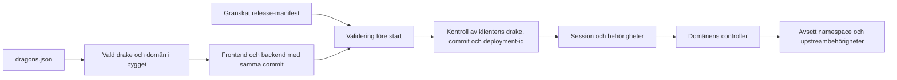

# Hur drakar hålls åtskilda

Draken har flera oberoende kontroller: importgränser, vald bygggraf, oföränderlig imageidentitet,
granskad deploymentkonfiguration och kontroll av klientens release före controlleranrop.
SAML-sessioner och upstreams behörigheter är fortfarande säkerhetsgränsen för användarnas data.

Diagrammet visar kontrollerna logiskt. Backendens befintliga autentiseringsguard kan avvisa
anrop före releasekontrollen; båda kontrollerna ligger före de skyddade controlleranropen.

## Vilka fel upptäcks?

| Fel | Kontroll och konsekvens |
| --- | --- |
| En drake importerar en annan | Importkontrollen stoppar ändringen. Delning sker genom domänägda kontrakt. |
| Ett gemensamt store-index drar in båda domänerna | Det universella indexet är borttaget; direkta importer och nya importregler skyddar gränsen. |
| Ny drake saknar entrypoint, env-exempel eller testtäckning | Katalog- och onboardingtester stoppar ändringen. Varje drake har ett faktiskt webbläsarprojekt. |
| En IAF-image startas med VOF-release | Oföränderlig byggmetadata jämförs med manifestet; processen startar inte. Samma gäller en annan commit. |
| En miljövariabel pekar på annat namespace, API eller grupper | Värdet jämförs med manifestet före start; en avvikelse stoppas utan att värdet loggas. |
| Fel drakes eller miljös hemlighetsreferens kopieras | Referensen måste börja med vald drake och test/production. Hemlighetsvärden förbjuds i environment. |
| En felaktig domänflagga ligger kvar i Adminpanel | Domänen härleds från bygget. Gamla domänfält ignoreras och kan inte ändra appen. |
| En gammal frontend anropar en ny backend | Både commit och deployment-id måste matcha. Annars 409 före controlleranropet. |
| Användaren försöker spara efter att ett sådant fel upptäckts | Klienten stannar i ett tydligt felläge som kräver full omladdning. Skrivningar återspelas inte. |
| Fel datavolym anges och volymen saknas | Compose kräver en befintlig extern volym; det skapas ingen tom ersättare automatiskt. |
| Två drakar startas på samma Docker-host | Genererad Compose har projektnamn per drake/miljö och uttryckliga, skilda hostportar. Starta med `-f` utan ett gemensamt projektöverstyrande `-p`. |

Releasefilen innehåller två fasta image-digests, commit, konfigurationsversion, miljöinställningar
och secret-referenser. SHA-256 av dess kanoniska JSON ger deployment-id:t. Ändras ett image,
namespace, en inställning eller referens ändras id:t; nycklarnas ordning påverkar det inte.
Båda tjänsterna använder samma manifest. Byggidentitet och commit är inbakade; runtimevariabler
kan inte byta dem. Se [leveranskontraktet](../../deployments/README.md).

API-klienten skickar `X-Draken-Dragon`, `X-Draken-Revision` och `X-Draken-Deployment` på alla
metoder. Domänservices kan inte överstyra dessa headers genom sina Axios-inställningar.
Backend jämför dem med sin egen validerade deployment, inte med klientvalda namespace.
Preflight, SAML-flöden, innehållsfria hälsoprober och GET av Swagger-specifikation/UI har sina
egna livscykler och läser inte ärendeinnehåll genom detta kontrakt. Swagger beskriver de tre
releaseheaders som obligatoriska API-parametrar med aktuell leverans som förvalt värde, så
dess Try it-anrop passerar samma kompatibilitets- och behörighetskontroller som frontendens anrop.

## Vad skydden inte ersätter

Headers är läsbara och kan förfalskas av en anropare; de är ett kompatibilitetsskydd och ingen
inloggning eller åtkomsttoken. Session, gruppbehörigheter, versionskontroll för skrivningar,
`X-Sent-By` och upstreams namespace-/AccessMapper-regler måste fortfarande vara rätt konfigurerade.
En granskad manifestfil är auktoriteten för avsett namespace; kod kan upptäcka avvikelser från den,
men inte veta om en människa ursprungligen godkänt fel namespace. Separata credentials med minsta
nödvändiga behörighet begränsar även den risken.

Garantin för klient/backend gäller den nya leveransvägen med båda tjänsternas kontroller aktiva.
Vid första övergången måste samtliga backendinstanser ha kontrollen innan ny frontend får trafik;
se migrationsordningen i leveranskontraktet. En gammal backend saknar detta skydd.
Externa pipeline-/routingändringar och verklig SAML/API-integration ska verifieras i målmiljön.
Frontends kvarvarande importbaseline innebär också att fullständig isolering av alla frontendbytes
ännu inte är uppnådd; detta är inte en säkerhetsgräns för ärendedata.

## Vad loggas och varför?

Tidigare reducerades gemensamma HTTP-fel till metod och status. Det skyddade ärendeuppgifter men
gjorde olika fel svåra att skilja åt. `request-diagnostics` äger nu strukturerade, begränsade fält:

| Fält | Syfte |
| --- | --- |
| `event` | Skiljer avslutat HTTP-anrop, HTTP-fel, upstreamanrop och applikationsfel. |
| `requestId` | Servergenererat UUID som binder ihop inkommande anrop och dess upstreamanrop. |
| `route` | Registrerad routemall, exempelvis `/supporterrands/:municipalityId/:id`, utan riktiga identifierare. |
| `method`, `status`, `durationMs` | Visar vilken operationstyp som fallerade, resultat och svarstid. |
| `errorKind`, `errorCode` | Fasta klassificeringar, exempelvis `upstream_network` och `ECONNREFUSED`. |
| `operation` | Statiskt namn från koden för fel utanför en entydig HTTP-operation. |

För anrop som passerar diagnostikmiddleware skapar servern ett nytt `X-Request-Id`,
returnerar det i svaret och skickar samma id till
upstream. Ett klientangivet id återanvänds inte, vilket förhindrar att en klient stoppar egna
personuppgifter i korrelationsfältet. Samtidiga anrop hålls isär med AsyncLocalStorage.
Hälsoproben `/health/up` undantas från den vanliga HTTP-loggen för att minska brus.

HTTP-/upstreamdiagnostiken loggar inte body, rå URL, query, headers, cookies, tokens, personnummer,
ärende-id, användarnamn, råa felmeddelanden eller godtyckliga stackar. Okänd route får en fast
markör. Granskade äldre anrop som skrev grupper, sökfilter, payloads och identifierare har
ersatts med statiska operationsnamn eller tagits bort. Driftposter använder samma diagnostikägare
och uttryckligen tillåtna värden för exempelvis miljö/port, rollkod och antal notiser.
Sessionsbibliotekets egna feltexter ersätts med en fast varning. SAML-flödets rate limiter
avvisar felaktiga klientadresser med ett fast 400-svar innan biblioteket kan skriva ut adressen;
befintlig begränsning av giltiga IPv4-/IPv6-anrop behålls. Ohanterade undantag och
promise-avvisningar får fasta processhändelser och felkoder; råa fel, stackar och processargument
skickas inte till loggtransporten. Processen avslutas med fel så att driftplattformen kan
återstarta den.

Winston skriver enradig JSON till konsolen och roterande debug-/errorfiler. Nya loggkataloger
skapas med behörighet 0700 och nya loggfiler med 0600. Befintliga filers behörigheter
ändras inte automatiskt. Ny automatisk gzip-komprimering är avstängd eftersom biblioteket
annars skapar arkiv med bredare standardbehörigheter innan de går att begränsa. Det ökar
behovet av diskutrymme, vilket drift ska följa upp. `LOG_RETENTION_DAYS` kan ange en beslutad tidsbaserad rotation i
backendens granskade release-manifest. Utan ett sådant beslut behålls tidigare 30-filersrotation;
det är ingen garanti om högsta lagringstid. Externa loggsamlare och äldre kopior behöver egna
åtkomst- och gallringsregler.

Loggarna hjälper drift att hitta ett fel och följa det till upstream utan att kopiera ärendet
till logglagringen. HTTP-felsvarens befintliga verksamhetskontrakt påverkas inte av loggbegränsningen.
Tester kontrollerar både diagnostikfält och att syntetiska känsliga värden inte förekommer.

## Gemensam standard och framtida ändringar

Frontendens `client-diagnostics` ersätter direkta konsolutskrifter i runtime-koden. Den lämnar
endast ett fast operationsnamn, en begränsad felklassificering och, när de finns, giltig
HTTP-status och validerat request-id. Felobjektet serialiseras aldrig. Tester använder
syntetiska kontaktuppgifter, anteckningar, headers och felobjekt för att kontrollera utdata;
ett webbläsartest provar ett verkligt felande meddelandeflöde.

`scripts/check-runtime-logging.mjs` äger källkodskontrollen för båda paketens runtime-kod,
inklusive nya filer. Den stoppar direkta loggvägar, loggerimporter och dynamiska operationsnamn,
även genom vanliga alias och namespace. Runtime får inte importera undantagna testfiler för
att kringgå kontrollen. Kontrollen körs i lint och byggen, även vid manuell byggstart.
Ändringar i diagnostikägarna måste även passera tester av det faktiska logginnehållet.

Samma dataminimering gäller i utveckling, test och produktion. Nexts vidarebefordran av
browserloggar till terminal och dess separata utvecklings-MCP-loggkanal är avstängda.
Generella `DEBUG`-/`NODE_DEBUG`-/`NODE_DEBUG_NATIVE`-flaggor avvisas av drakans startkontrakt
så att biblioteksdiagnostik inte råkar skriva headers eller miljöhemligheter vid manuell felsökning.

Hemlighetsfiler avvisas även om de innehåller NUL innan en process startas. Annars kan Nodes
felmeddelande vid processstart återge hemlighetsvärdet. Regressionstestet kör båda launcherna,
kontrollerar stdout/stderr och verifierar att vanliga PEM-radbrytningar fortfarande fungerar.

## Drift och skyddets gränser

Den gemensamma standarden begränsar applikationens egna loggar. Den filtrerar inte automatiskt
loggning som en proxy, ett tredjepartsbibliotek eller en extern loggsamlare skapar själv.
Proxy-/containerloggarnas innehåll, läsbehörigheter och gallring måste verifieras i målmiljön.
Ändringarna raderar inte redan skrivna loggar. Ett korrelations-id innebär inte att loggen är
anonym. Åtkomst- och ändringsspår för känsliga ärenden behöver ett eget tydligt ändamål och
ska verifieras hos tjänsten som äger revisionsspåret.

Se [loggstandard och manuell felsökning](../operations/logging.md) för ägare, arbetsgång,
valideringskommandon och driftens verifiering. Dessa skydd minskar konkreta felrisker;
de är inte i sig ett intyg om hela applikationens säkerhet eller dataskyddsefterlevnad.
